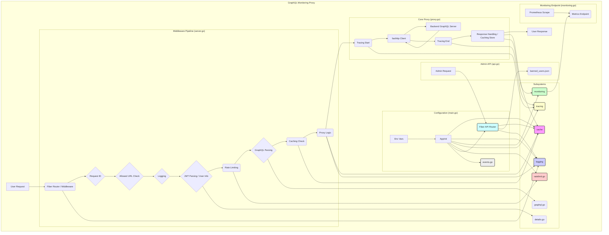

# GraphQL Monitoring Proxy - Architectural Analysis Plan

## 1. Architectural Overview

*   **Core:** A Go application built using the `fiber` web framework acting as a passthrough proxy (`proxy.go`) for GraphQL requests. It intercepts requests, performs analysis/actions, and forwards them to a backend GraphQL server (`HOST_GRAPHQL`, `HOST_GRAPHQL_READONLY`).
*   **Middleware Pipeline:** Leverages Fiber's middleware capabilities for request ID generation, URL filtering, logging, JWT parsing, rate limiting, caching checks, and finally, proxying (`server.go`).
*   **Subsystems (Packages):** Functionality is modularized into packages:
    *   `cache`: Interface-based caching (memory/Redis).
    *   `logging`: Custom structured logger.
    *   `monitoring`: Prometheus metrics generation.
    *   `tracing`: OpenTelemetry integration.
    *   `ratelimit`: Role-based request limiting.
*   **Configuration:** Driven primarily by environment variables (`main.go`, `struct_config.go`).
*   **API:** An optional, separate Fiber instance provides administrative endpoints (`api.go`).
*   **Background Tasks:** Goroutines handle periodic tasks like cache cleanup (`cache/memory/memory.go`), banned user list reloading (`api.go`), and Hasura event cleaning (`events.go`).

## 2. Architectural Diagram

## 3. Proposed Improvement Areas

*   **Performance:** Connection pooling (`fasthttp`), GraphQL parsing optimization, concurrent request handling limits, cache hit ratio analysis.
*   **Resource Usage:** Memory footprint of in-memory cache (compression effectiveness), object pooling (GraphQL AST nodes?), goroutine lifecycle management.
*   **Reliability:** Deeper health checks (dependencies like Redis), configuration validation at startup, error propagation and handling consistency, circuit breaking for backend calls.
*   **Security:** API endpoint authentication/authorization, dependency vulnerability scanning (Go modules), input sanitization (if applicable beyond GraphQL structure), secrets management (Redis password).